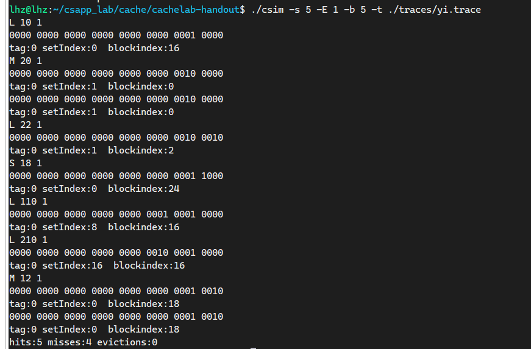
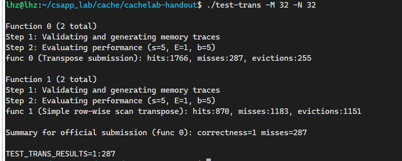
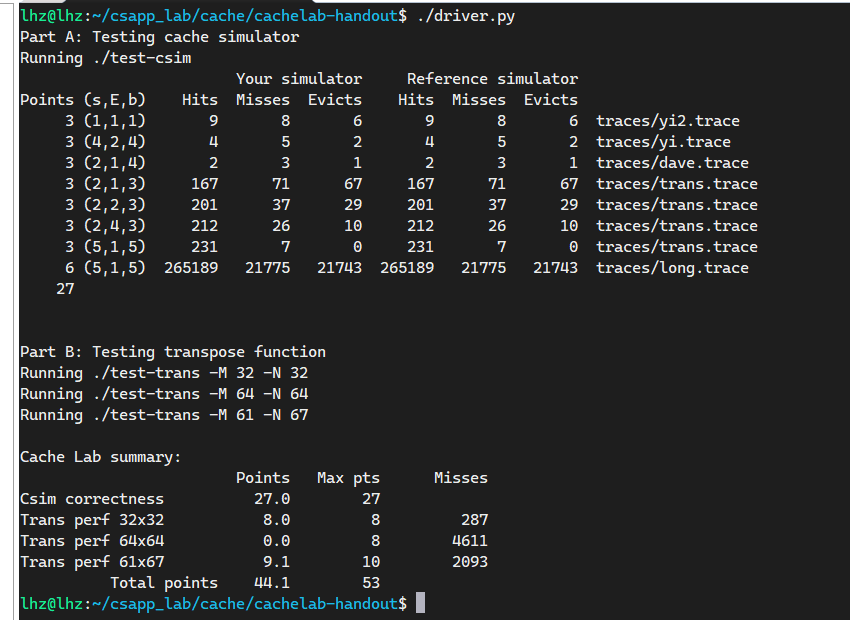
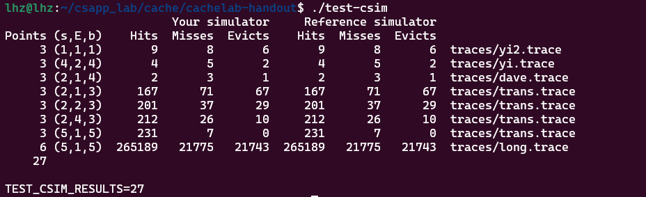

# CACHE_LAB

## 前置知识

单独测试

```
make clean && make
```

A测试指定文件
./csim -s 5 -E 1 -b 5 -t ./traces/yi.trace

A测试全部文件

./test-csim



B测试
./test-trans -M 32 -N 32
./test-trans -M 64 -N 64



最终全部测试 

```
安装python2
sudo apt install python2
设置优先级
sudo update-alternatives --install /usr/bin/python python /usr/bin/python2.7 1
运行跑分程序
./drive.py
```



## Phase1

这个只要理解cache如何映射，用基本的c语言编写出来，没什么难点



## Phase2

分块