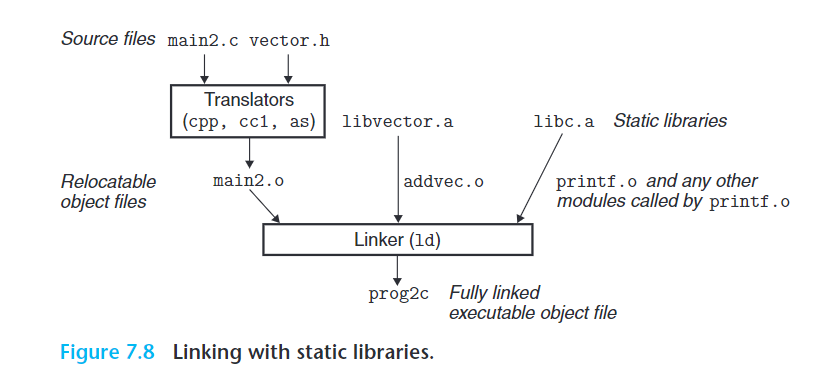

# static library

## 概念

是什么：打包多个related object 文件到一个单独的文件(.a)，在生成可执行文件时，linker只用拷贝需要引用的部分（.a的一部分定义）到可执行文件，这个文件叫static library。

为什么：

引入基础库的方法1：编译器根据function自动生成代码，但是每次添加和修改function都要更新编译器，

引入基础库的方法2：把基础库代码放在一个related object 文件（.o）,但是每个可执行文件都要包含.o库文件的代码，这很浪费空间，并且每次都要一起编译。（如下）

```
gcc main.c /usr/lib/libc.o
```

引入基础库的方法3：把基础库文件分割成多个(.o),但是link的时候需要指定很多个，容易出错（如下）

```
linux>gcc main.c /usr/lib/printf.o /usr/lib/scanf.o...
```

static library引入基础库：把需要的各种function，分割成多个模块，然后再打包成一个static library

```
linux>gcc main.c /usr/lib/libm.a /usr/lib/libc.a
```

（感觉是按照功能分组打包了一下,就是2和3的结合取优点）

好处：引入文件数量减少，减少空间

## 案例

```
//编译两个.c到两个.o
linux>gcc -c addvec.c multvec.c
//两个.o打包成一个.a（静态库）
linux>ar rcs libvector.a addvec.o multvec.o

//main.c引用静态库
linux>gcc -c main2.c
linux>gcc -static -o prog2c main2.o ./libvector.a


等于
linux>gcc -c main2.c
linux>gcc -static -o prog2c main2.o -L. -lvector
```



## 静态库如何解析引用

linker按照顺序扫描所有输入的文件（通过控制台输入，例如gcc -static ./libvector.a main2.c）

linker 有三个集合

- E：将要合并成可执行文件的relocatable object files
- U: symbols referred to but not yet defined（符号引用）
- D: symbols that have been defined in previous input files.（符号定义）

1. 对于一个输入文件f，如果f是.o文件，那么linker把f添加到E,并更新U和D，去映射f中的符号定义，接着扫描下一个。
2. 如果f是.a文件，linker 尝试把U中的未解析的符号引用去匹配.a中的符号定义。如果.a文件的一个member（其中一个.a文件） m 定义了一个U中的符号，那么把m添加到E，linker更新U和D去映射m中的符号引用和符号定义。这个过程会一直迭代直到U和D不在改变。最后，任何不包含在E中的 .a 文件都会被丢弃，链接器继续处理下一个输入文件.
3. 当linker扫描输入的文件后，U不是空的，就会打印错误(有符号引用没有定义)，否则，会把所有E中的目标文件输出成可执行文件。

