# Attack_LAB

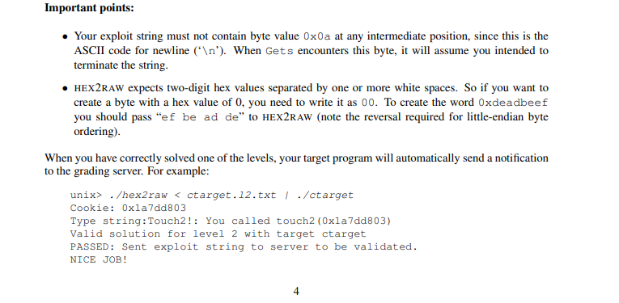

应该从文件里读取十六进制的结果

## phase_1

gdb调试ctarget，使用-q 不连接服务器

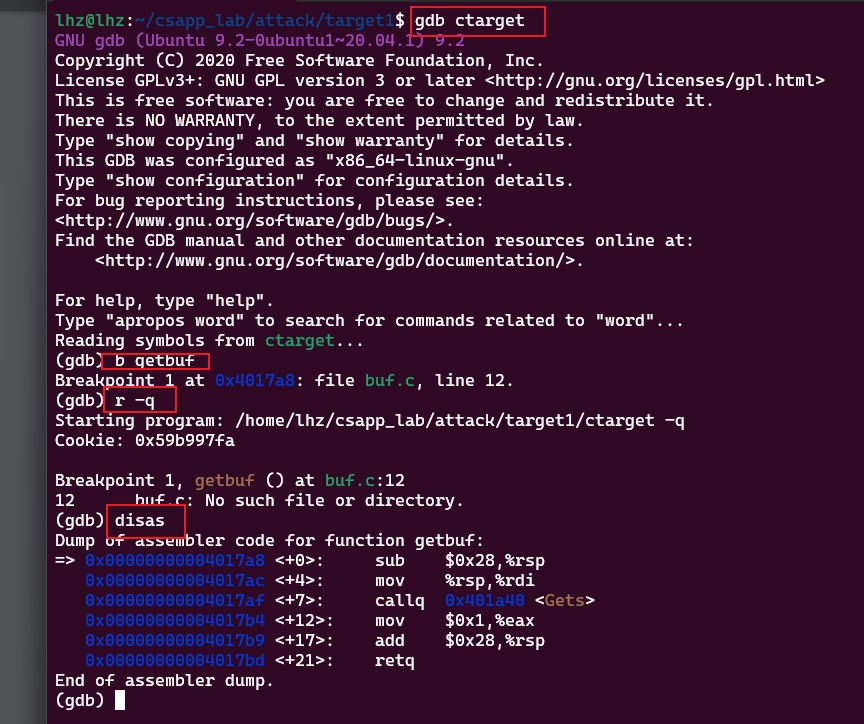

栈帧结构

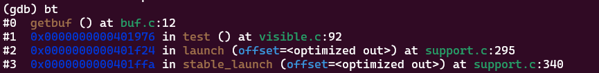

进入getbuf

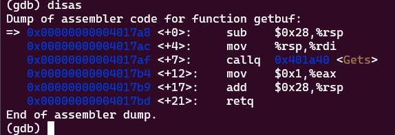

走到gets方法 输入0123456789查看栈的样子

检查现在栈的范围

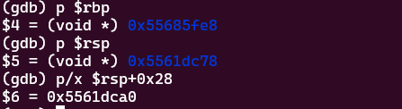

如下

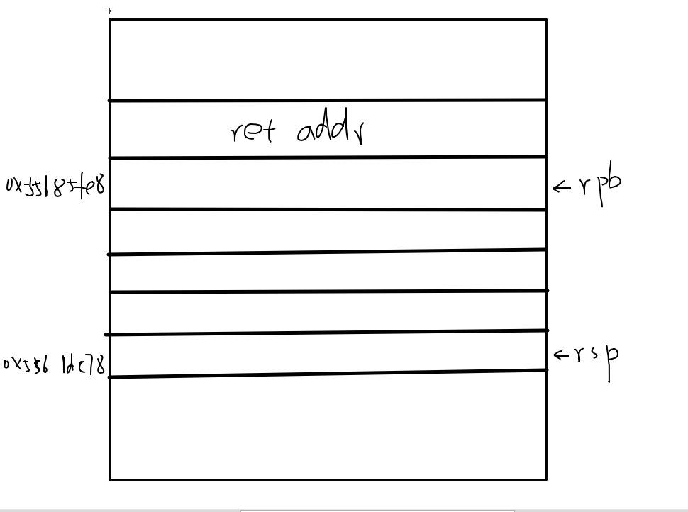

检查从rsp到 ret 具体的内容

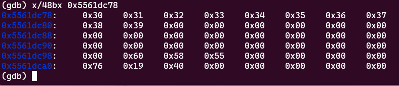

0x5561dc78之后是我们输入的0123456789的每个字符对应的ascii码，0x5561dca0所存放的值显而易见是返回的地址

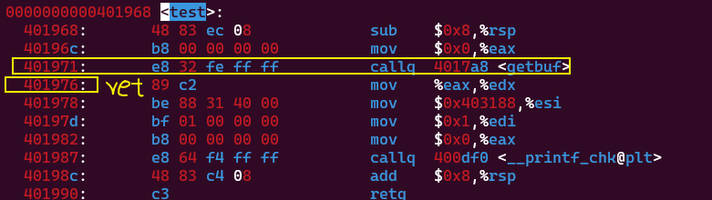


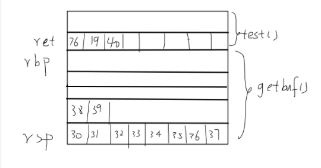


所以我们要输入43的字符，40个填充buff缓冲区，剩下3个40 17 c0填充ret指向touch1的地址

由于提示读取文件所以要得到0x4017c0,文本中应该是 

c0 17 40

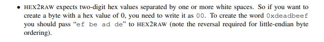

所以答案,保存在ctarget1.txt中

```
00 00 00 00 00 00 00 00
00 00 00 00 00 00 00 00
00 00 00 00 00 00 00 00
00 00 00 00 00 00 00 00
00 00 00 00 00 00 00 00
c0 17 40 00 00 00 00 00
```

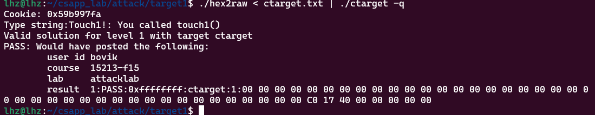

