## Bomb

## GDB命令 常用

```
x/<n/f/u>  [<addr>|$<reg>]
n往后几个
f 多少字节一个单位：b=1 byte, h=2 bytes,w=4 bytes,g=8 bytes
u什么格式输出：x=十六进制，o =八进制，d=十进制,s=按字符串，
```

已知在0x7fffffffe2c8和 0x7fffffffe2cc保存了两个int(这两个地址相邻)，分别为7 和9，

当我想要查看这两可以使用**x/2wd**命令，打印内存的值

2：输出2个，w：4字节一个单位，d：十进制格式输出

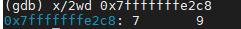

想要查看字符串可以**x/s**

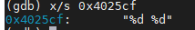

## phase_1

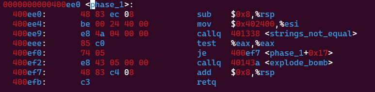

callq string_not_equla后，

test %eax %eax 就可以跳转到 400ef7 成功返回 ，

否则如果eax不是0触发 callq explpde_bomb直接炸

所以在 string_not_equal 寻找如何让eax变成0

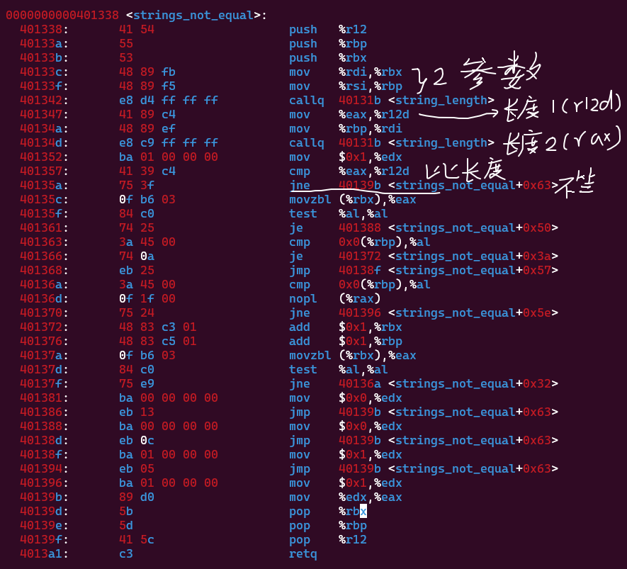

40113c 40113f 接收两个参数 分别放到rbx和rbp，

401342 call string_length算长度 结果放在rax，

401347 然后通过第一个参数长度 从rax放到r12d

40134a 把rbp的参数放到rdi 

40134d 调用call string_length算长度 第二个参数长度结果放在rax

401352 edx默认1

401357 比较rax和r12d，如果不相等，直接跳到40139b，把edx的1赋值给rax，返回phase_1，直接炸


如果长度相等

根据401372 401376每次rbx和rpx加一

可以判断字符串一个一个循环比较，相等比较下一个位置，直到全部相等。

所以，这个方法是判断两个字符串是否完全相等，关键是查看参数具体值，需要gdb来打印内存的值

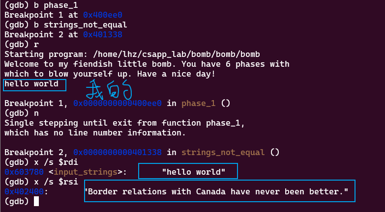

可以看到rdi是我自己输入的，rsi就是密码，因此复制粘贴 输入 

```
Border relations with Canada have never been better.
```

通过第一个炸弹

## phase_2

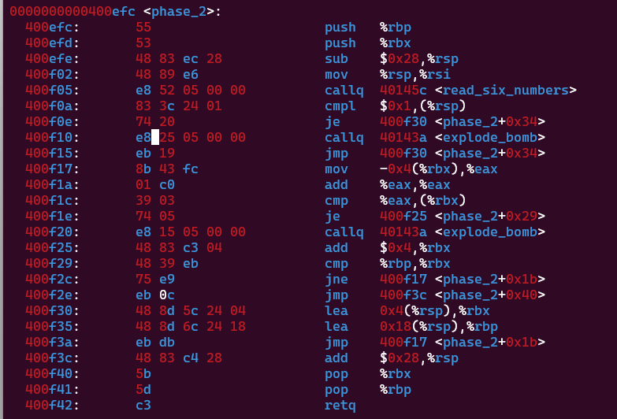


根据sub 0x28 %rsp，rsp=rsp-40 可知即将有局部变量存入栈中（**设当前rsp地址=r**）

400f05读取6个数字，

400f0a  判断rsp指针所指的值是否等于1 jump，否则explpde_bomb(**第一个数(rsp)=1**)


400f30 **rbx=rsp+4（r+4）** 栈指针向后 (**第二个数**)

400f35 rbp =rsp+24 （r+24）栈指针向后 (**第六个数**)

jump

400f17 rax=(rbx-4)=(r)=1

400f1a rax = rax+rax=2

400f1c 比较rax和(rbx)的的值 

可以知道 (rbx)=2(**第二个数(rsp+4)=2**)


400f25 **rbx=rbx+4=（r+8**） 继续向后(**第三个数**)

400f29 rbx和rbp不是一个地址，即是所有数字判断完了， jump

400f17 rax=(rbx-4)=（r+4）=2

400f1a rax = rax+rax=4

400f1c 比较rax和(rbx)的的值 

可以知道 (rbx)=4(**第三个数(rsp+8)=4**)

....

**可以得出规律，后一个数就是前一个数的2倍**

所以6个数字为以下，解除第二个炸弹

```
1 2 4 8 16 32
```

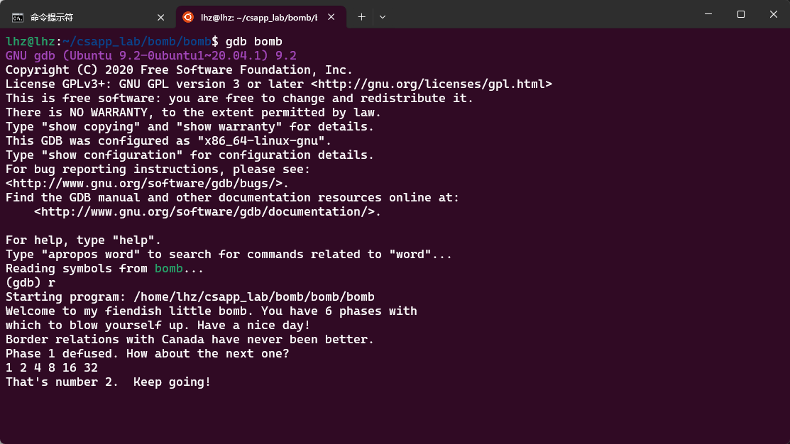

## phase_3

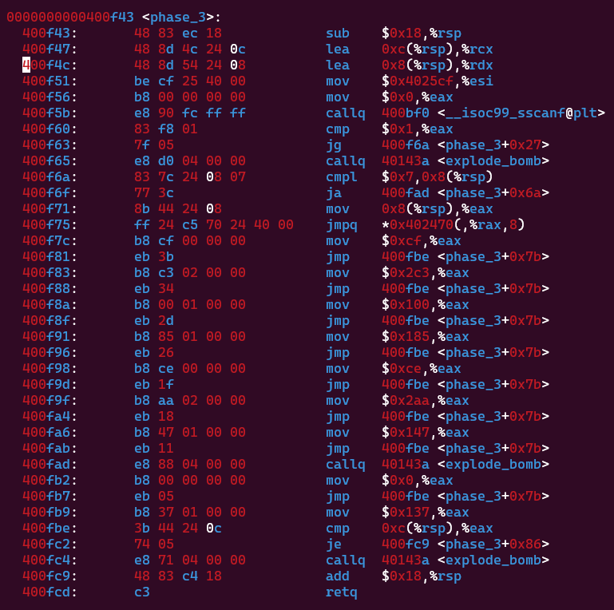

首先学习一下sscanf用法，

```c
int a;
int r =sscanf("10","%d",&a)
//r=1 a=10
    
int a1;
int a2;
int r =sscanf("10 20","%d %d",&a1,&a2)
//r=2 a1=10 a2=20
```

根据csapp寄存器参数使用顺序可以分析出，sscanf接收参数(rdi,rsi,&rcx,&rdx)，

因此输入的两个参数分别在rsp+12和rsp+8里面，并且返回rax=2

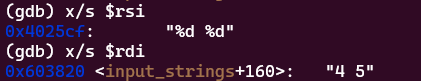

实际上可以看到执行完 sscanf返回rax=2

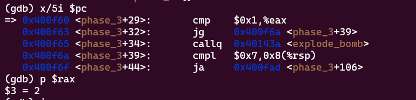


400f60 cmp    $0x1,%eax    因为rax=2>1 所以jump 400f6a

400f6a cmpl $0x7,0x8(%rsp)， 

400f6f 如果(rsp+8)>7那么 jump 400fad,explode_bomb，所以(rsp+8)必须<=7,

400f71 rax=(rsp+8)

400f75  jump \*(8 \* rax+0x402470)地址所指向的地址  （一定要在400f7c到400fb2之间，才能往下继续）然后给rax赋值

指针地址有 0x402470  0x402478 0x402480 0x402488 0x402490   0x402498  0x4024A0  0x4024A8

所以依次查看这些地址的值

x打印指针的值 8gx（**后显示8个地址，g表示八字节，按十六进制格式显示变量**）

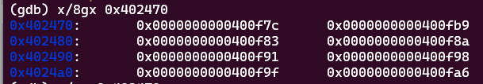

根据switch(rax) case一下8种

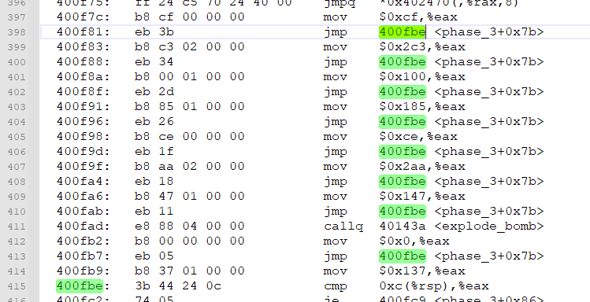

最终要去 

400fbe  cmp    0xc(%rsp),%eax，如果(rsp+12)！= rax 那么 explode_bomb

所以（rsp+8）和（rsp+12）之前存在着联动

**具体步骤**

当rax=(rsp+8)=0  jump 0x0000000000400f7c, rax=0xcf = 207   =>(rsp+8)=0  (rsp+12)=207   

当rax=(rsp+8)=1  jump 0x0000000000400fb9, rax=0x137=311=>(rsp+8)=1  (rsp+12)=311

当rax=(rsp+8)=2  jump 0x0000000000400f83, rax=0x2c3=707  =>(rsp+8)=2  (rsp+12)=707

当rax=(rsp+8)=3  jump 0x0000000000400f8a, rax=0x100=256  =>(rsp+8)=3  (rsp+12)=256  

当rax=(rsp+8)=4  jump 0x0000000000400f91, rax=0x185=389  =>(rsp+8)=4  (rsp+12)=389  

当rax=(rsp+8)=5  jump 0x0000000000400f98, rax=0xce=206  =>(rsp+8)=5  (rsp+12)=206  

当rax=(rsp+8)=6  jump 0x0000000000400f9f, rax=0x2aa=682  =>(rsp+8)=6  (rsp+12)=682  

当rax=(rsp+8)=7  jump 0x0000000000400fa6, rax=0x147=327  =>(rsp+8)=7  (rsp+12)=327  

又因为参数越靠后栈的位置越大（越靠近栈底部）  所以 (rsp+8)为第1个 ，(rsp+12)为第二个

**输入以上组合都可以，解除第三个炸弹**

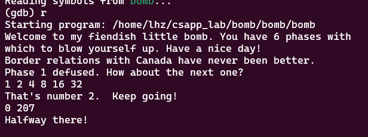


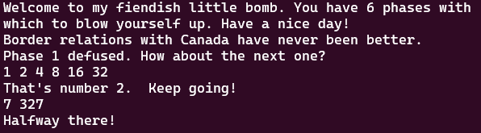

## phase_4

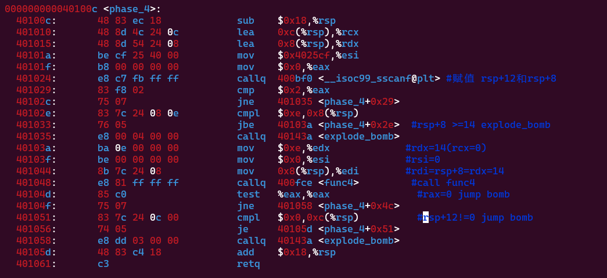

40100c-401029：和phase_3一模一样，sscanf接收参数(rdi,rsi,&rcx,&rdx)，返回2成功，否则bomb！

401029：  比较M[rsp+8]（即第一个参数）和0xe(十进制的14),如果M[rsp+8]大于等于14，那么bomb！

40103a-401048： 如果M[rsp+8]小于14，那么令rdx=14，rsi=0，rdi=M[rsp+8],根据寄存器作为参数的顺序可以知道，调用rax=func(rdi,rsi,rdx)，暂时不管，我们看后续

40104d-40104f：比较rax是否等于0，如果不等于0，直接跳转到bomb

401051：比较M[rsp+12]是否等于0，如果等于跳到return，成功


**经过上面分析我们知道了，rax=func4(M[rsp+8],0,14) 必须等于0，arg1=M[rsp+8]必须<14,arg2=M[rsp+12]必须=0**

所以核心点在func4，当M[rsp+8]等于多少的时候rax才能为0，读汇编代码，可以很容易把func4写出来，下面是java代码的实现，我们挨个尝试

```java
    public static int func4(int rdi, int rsi, int rdx) {
        int rax = rdx;
        rax = rdx - rsi;
        //逻辑
        int rcx = rax >>> 31;
        rax =  rcx + rax;
        //算数
        rax = rax >> 1;
        rcx = rsi + rax;

        if (rcx <= rdi) {
            rax = 0;
            if (rcx >= rdi) {
                return rax;
            } else {
                rsi = rcx + 1;
                int r = func4(rdi, rsi, rdx);
                rax = r + r + 1;
                return rax;
            }
        }else {
            rdx = rcx - 1;
            int r = func4(rdi, rsi, rdx);
            rax = r + r;
            return rax;
        }

    }

    public static void main(String[] args) {
        for (int i = 0; i < 14; i++) {
            int result = func4(i, 0, 14);
            System.out.println("args1: " + i+",result: " + result);
        }
    }


```

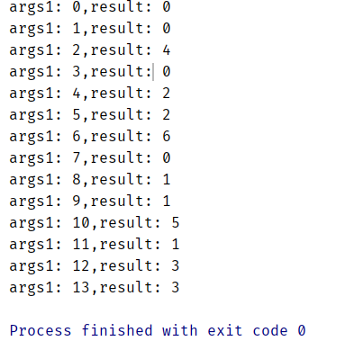

看看结果，选 result 为 0 的args1作为参数1，依次带入实验都可以成功0，1，3，7

所以可有输入0 0或1 0或3 0或 7 0

因此**输入以上组合都可以，解除第四个炸弹**

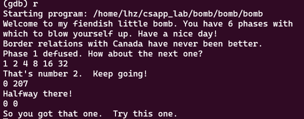


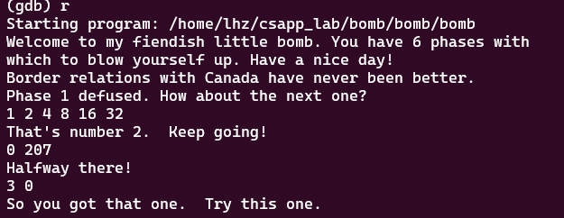

phase_5
