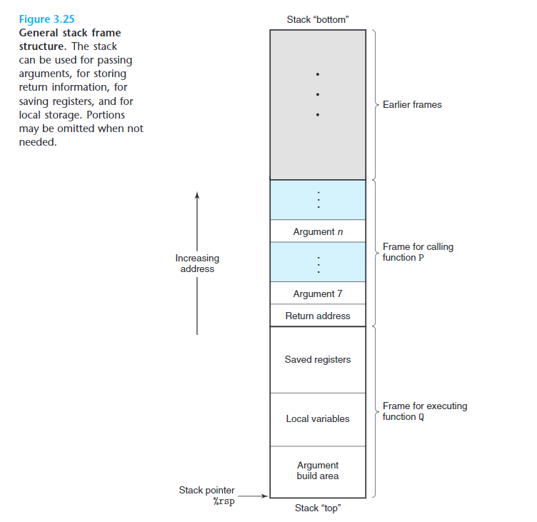
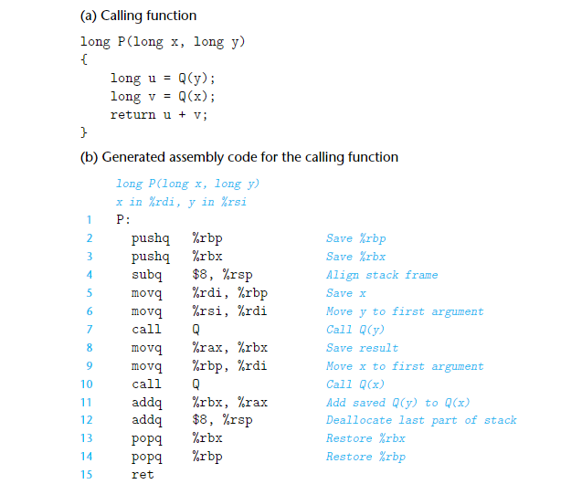

# procedure

## 寄存器分类

 %rbx,%rbp, and%r12–%r15are classified as **callee-saved registers**

也叫**非易失性寄存器**，在程序调用过程中，这些寄存器中的值需要被保存，不能被覆盖；当某个程序调用这些寄存器，被调用寄存器会先保存这些值然后再进行调用，且在调用结束后恢复被调用之前的值；

rcx %rdx %rsi %rdi %r8 %r9   **callee-saved registers**

也叫**易失性寄存器**，在程序调用的过程中，这些寄存器中的值不需要被保存（即压入到栈中再从栈中取出），如果某一个程序需要保存这个寄存器的值，需要调用者自己压入栈

%rsp 栈指针

%rip 下一条将要被执行的指令的逻辑地址

## Stack

## Local Storage in Stack

## Local Storage in Registers（Saved registers部分）

