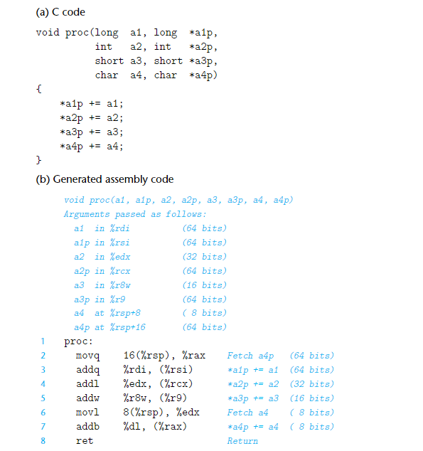
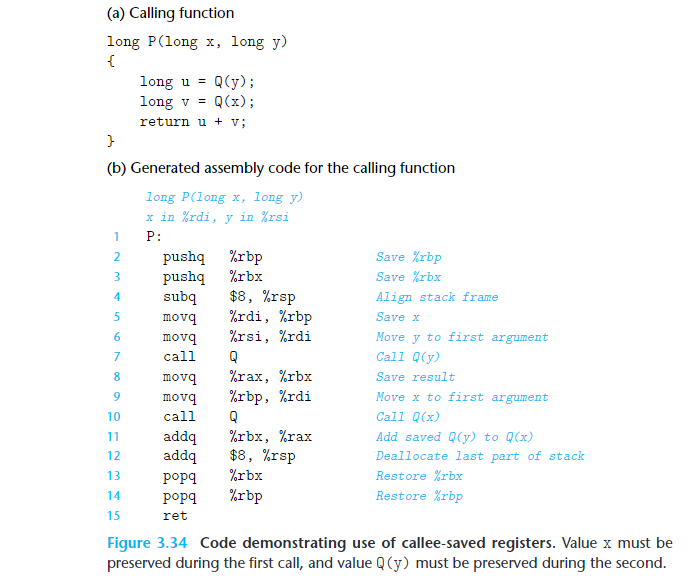

# procedure

## 寄存器分类

 %rbx,%rbp, and%r12–%r15are classified as **callee-saved registers**

%rdi  %rsi  %rdx  %rcx    %r8 %r9   **caller-saved registers**

%rsp 栈指针

%rip 下一条将要被执行的指令的逻辑地址

## Stack

## Control Transfer

call：被调用方法返回后的下一条指令地址（return address）push 到stack，然后pc设置为被调用方法的首地址

ret：pop出return address，然后pc设置为return address

## Data Transfer（arguments）

函数超过6个参数，存储在stack里面

## Local Storage on Stack（Local variables）

结合data transfer和local storage例子

为local variable设置栈帧，参数和加载方法的参数到register

上图表示local variables x1-x4在 stack 的分配，**变量在stack不用对齐**； parameters x1-x4和&x1-&x4 6个分配在register，2个分配在stack,**参数在stack要对齐**

## Local Storage in Registers（Saved registers部分）

（使用**callee-saved registers**来保存变量，必须在callee()里面保存之前caller()的寄存器数据到stack，再使用，callee()执行完返回后，把stack的变量写回到寄存器，交给caller()继续执行)

The name“caller saved”: can be understood in the context of a procedure P having some local data in such a register and calling procedure Q. Since Q is free to alter this register,it is incumbent upon P(the caller) to first save the data before it makes the call.

